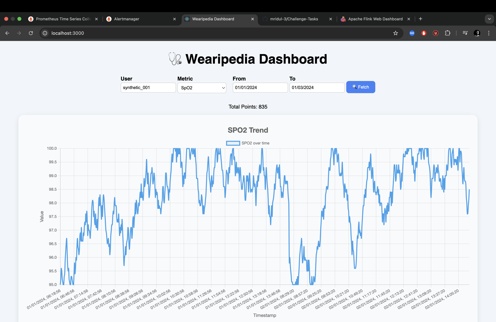

# 📊 Task-4: Dashboard (React.js + API + Chart.js + SMTP)

## 📌 Objective

Develop an interactive, professional web dashboard using **React.js** that allows users to:

- Select user, metric, and date range
- Fetch data from the FastAPI backend (Task-2)
- Visualize the time series using **Chart.js**
- Automatically switch between raw and aggregated metrics depending on date span
- Display alerts/errors and handle large datasets efficiently
- Integrate with **SMTP** for future alert notifications

---

## 🧱 Tech Stack

- **React.js (Vite)** for the frontend
- **Chart.js** with `react-chartjs-2` for visualizations
- **axios** for API requests
- **DatePicker** for selecting date ranges
- **Docker** for containerization
- **SMTP** config stub for integration with Alertmanager (Task-5)

---

## 🖥️ Features

- 📈 Dynamic chart visualization based on selected metric
- 🗓️ Date range picker for custom time filtering
- ⚙️ Auto-selects appropriate TimescaleDB table (`raw_data`, `data_1h`, `data_1d`) via FastAPI
- 📬 Configured to support alert emails via SMTP
- 🌐 CORS support to communicate with backend
- 🔁 Horizontal scroll for large time windows

---

## 🧪 Available Metrics

- `heart_rate`
- `spo2`
- `activity`
- `breath_rate`
- `hrv`
- `active_zone_minute`

---

## 🚀 Getting Started

### 1️⃣ Install Dependencies

```bash
cd Task-4/frontend
npm install
```

2️⃣ Start Locally
```bash
npm run dev
```
### 3️⃣ Build for Production

```bash
npm run build
```
📂 File Structure
```Task-4/
├── frontend/
│   ├── src/
│   │   ├── App.jsx               # Main dashboard
│   │   └── App.css               # Minimal styling
│   ├── package.json
│   └── Dockerfile
```

✨ UI Preview



	• Header: 🩺 Wearipedia Dashboard
	• Input controls for user, metric, date range

📬 SMTP Integration (for Task-5)

SMTP credentials are configured via .env and passed to Alertmanager for email-based alerts. These alerts originate from monitored backend scripts or data issues.

🔧 Notes
	• Horizontal scrolling is enabled only for the graph container
	• X-axis ticks auto-expand for long date ranges
	• You can modify granularity by changing /data query params on the backend

⸻

🧠 Design Decisions
	• Chart.js offers excellent performance + aesthetic defaults
	• Scrollable chart avoids UI overflow and maintains clarity for dense time data
	• Using Math.max(data.length * 12, 1000) auto-expands chart width dynamically
	• Optimized for TimescaleDB rollups (via API)

✅ Status

✅ Fully functional
✅ Responsive & visually appealing
✅ Integrated with backend
✅ Ready for Grafana + SMTP alerts