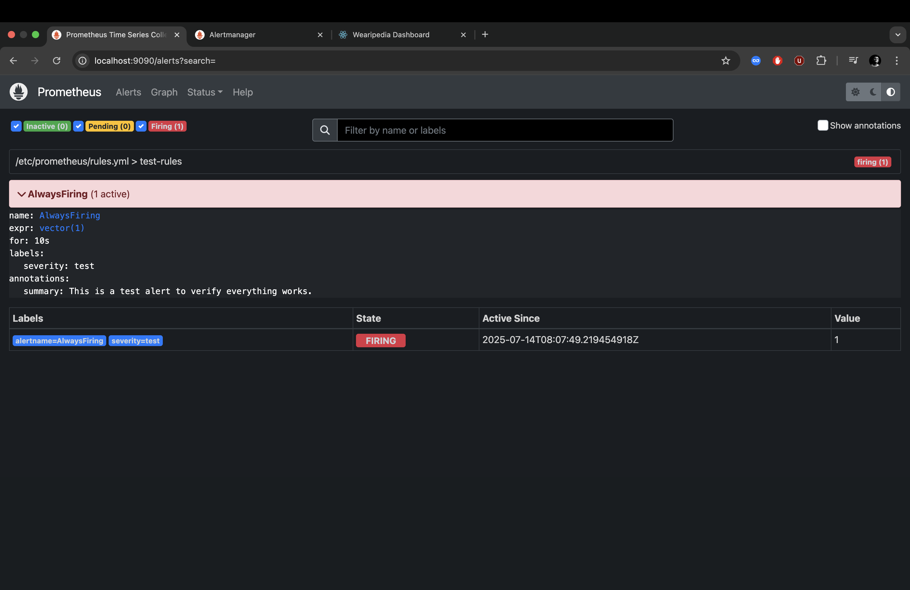
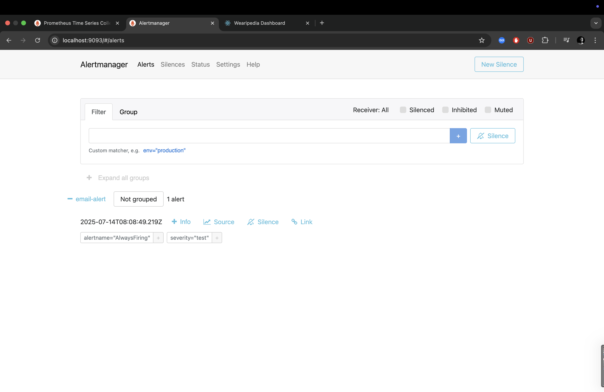

# 🛡️ Task-5: Monitoring & Alerting with Prometheus + Alertmanager

This task implements real-time monitoring and alerting for the Wearipedia Fitbit data pipeline using **Prometheus** and **Alertmanager**. This setup ensures that key system metrics can be observed and alerts can be triggered on abnormal behavior, such as data pipeline stalls, ingestion failure, or custom metric thresholds.

---

## 📦 Components

### 🔍 Prometheus
- Scrapes metrics from the FastAPI application and other services.
- Uses `prometheus.yml` configuration to discover targets.
- Exposes a dashboard at **http://localhost:9090**.

### 🚨 Alertmanager
- Handles alerts triggered by Prometheus.
- Configured to send **email alerts** using environment-specific SMTP credentials.
- Accessible at **http://localhost:9093**.

---

## ⚙️ Configuration Files

### `prometheus.yml`
Defines scrape intervals, targets (such as `api`, `metrics.py` exporter), and alert rules:
```yaml
scrape_configs:
  - job_name: 'api'
    static_configs:
      - targets: ['api:8000']

  - job_name: 'custom-metrics'
    static_configs:
      - targets: ['metrics:8001']

🖼️ Dashboard Screenshots

✅ Prometheus Dashboard



⚠️ Alertmanager Dashboard



Prometheus pulls this data every 15 seconds to evaluate alert rules.

🚀 Running the Stack
### 1. Start Prometheus and Alertmanager
```bash
docker-compose up -d prometheus alertmanager
```
### 2. Verify dashboards:

	• Prometheus: http://localhost:9090
	• Alertmanager: http://localhost:9093


✅ Design Decisions
	• Separation of metrics server (metrics.py) ensures Prometheus can scrape independently of the main API.
	• SMTP credentials are loaded via .env to support secure deployment.
	• rules.yml is modular and can be extended with custom thresholds per metric (e.g., abnormal HRV values).
	• Prometheus + Alertmanager combo gives high observability at minimal infrastructure cost.

📁 Directory Structure
Task-5/
├── Dockerfile
├── prometheus.yml
├── alertmanager.yml
├── rules.yml
└── metrics.py

📌 Improvements Possible
	• Add Grafana dashboards for richer visualization.
	• Integrate Slack or PagerDuty for more advanced alerting.
	• Auto-scaling alerts based on CPU/memory usage via node_exporter.

⸻

🧠 Summary

This monitoring stack plays a crucial role in operational excellence by:
	• Ensuring real-time visibility of ingestion performance.
	• Alerting engineers proactively on failure.
	• Laying groundwork for production-grade observability.