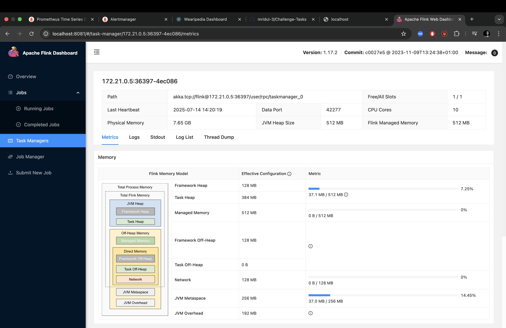

# ⚙️ Task-6: Horizontal Scaling and Query Acceleration (Kafka + Flink + Trino)

This task addresses the **scalability and performance optimization** of the Fitbit time-series pipeline by introducing a horizontally scalable architecture using **Kafka** for ingestion, **Flink** for real-time processing, and **Trino** for distributed SQL querying.

---

## 🚀 Objectives

- 🧩 Ingest data via Kafka topic `fitbit_ingestion`.
- 🔁 Stream and transform data using Apache Flink in real-time.
- 🧠 Query massive datasets interactively using Trino.
- 📊 Visualize and inspect data flow via Kafka UI.

---

## 🧱 Architecture

        +-------------+
        |  Frontend   |
        +------+------+                               
               |                                        
               v                                        
        +------+-------+     Kafka Topic: fitbit_ingestion      
        | FastAPI/API  |---------------------------+              
        +------+-------+                           |        
               |                                   |          
       +-------v------+                            |          
       |   Kafka (B)   |<--------------------+      |     
       +-------+------+                     |      |     
               |                            |      v      
       +-------v------+              +------+--------+     
       |    Flink      |              |   Kafka UI   |     
       +-------+------+              +------+--------+     
               |                            |              
       +-------v------+                    ...            
       | TimescaleDB  |              +-------------+      
       +--------------+              |    Trino    |      
                                     +-------------+      

---

## 🧩 Technologies Used

| Tool        | Purpose                             |
|-------------|-------------------------------------|
| **Kafka**   | Stream ingestion pipeline           |
| **Flink**   | Real-time processing & enrichment   |
| **Trino**   | Distributed SQL querying            |
| **Kafka UI**| Inspect topics, producers, etc.     |

---

## 🛠️ Setup & Usage

### ✅ Prerequisites

- Docker & Docker Compose installed
- `.env` file populated with:
```env
KAFKA_BROKER=kafka:9092
KAFKA_TOPIC=fitbit_ingestion
TRINO_HOST=trino
TRINO_PORT=8080
```

📦 Build and Launch
	1. Create Docker Network (if not already created):
```bash
docker network create fitbit
```

    2. Start Kafka, Flink, and Trino services:
```bash
docker-compose -f Task-6/docker-compose.kafka.yml up -d --remove-orphans
```

    3. Verify services:
```bash
docker ps
```
    4. Launch the Kafka worker to consume from topic and write to TimescaleDB:
```bash
docker-compose run --rm kafka-worker
```
You should see logs like:
```bash
Connected to TimescaleDB
Connected to Kafka topic: fitbit_ingestion
Listening to Kafka topic: fitbit_ingestion...
```

🧠 Flink Logic (worker.py)

The worker.py connects to the Kafka topic fitbit_ingestion, reads JSON-structured time-series records, and inserts them into TimescaleDB tables. It ensures deduplication and type validation.



📁 Directory Layout
Task-6/
├── docker-compose.kafka.yml
├── Dockerfile
├── worker.py
├── requirements.txt

📈 Metrics & Monitoring
	• All Kafka/Flink services are connected to Prometheus (Task-5).
	• Custom metrics exposed via metrics.py (optional).
	• Alerting rules can be added for Kafka lag, Flink failure, etc.

⸻

✅ Design Justification
	• Kafka decouples ingestion from processing, allowing elastic scaling.
	• Flink enables low-latency enrichment and streaming joins if needed.
	• Trino supports federated querying across TimescaleDB, S3, and more in future.
	• This architecture sets the foundation for multi-user, multi-tenant scale.

⸻

📌 Future Enhancements
	• Schema registry for event contracts.
	• Use FlinkSQL or Kafka Connect for declarative ingestion.
	• Trino federation across PostgreSQL + Iceberg + Object Storage.
	• Kafka lag monitoring + backpressure metrics in Grafana.

⸻

🧠 Summary

Task-6 elevates the Fitbit pipeline to production-grade scalability by:
	• Decoupling ingestion from DB writes.
	• Providing stream processing via Flink.
	• Enabling high-speed analytics with Trino.
	• Offering real-time visibility with Kafka UI.